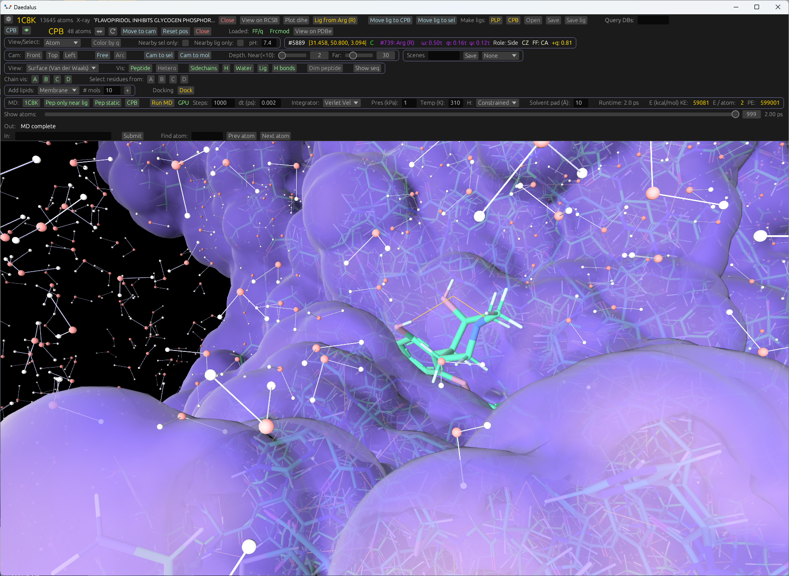
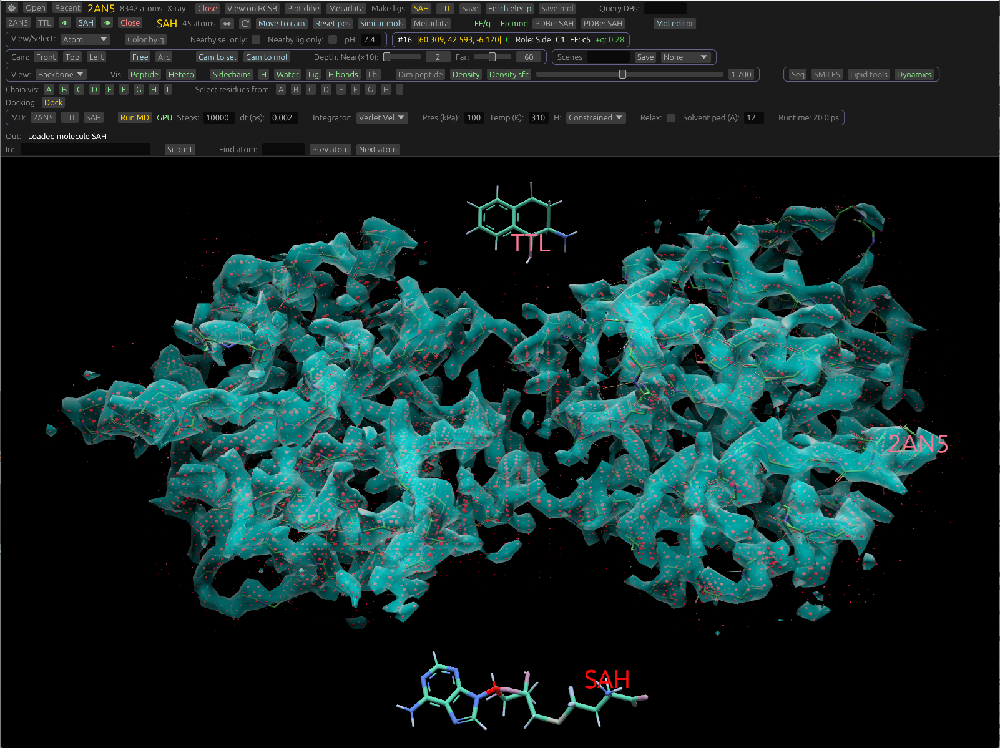

# Daedalus: structural biology

[//]: # ([![Crate]&#40;https://img.shields.io/crates/v/daedalus.svg&#41;]&#40;https://crates.io/crates/daedalus&#41;)

[Home page](https://www.athanorlab.com/daedalus)
[Documentation](https://www.athanorlab.com/docs)

## Goal: The easiest to use structural biology tool

For viewing and exploring proteins and small molecules. View atom positions, bonds, solvent-accessible-surfaces, and
electron density. Perform and visualize molecular dynamics using built-in [Amber](https://ambermd.org/) parameters.

Blends functionality similar to [PyMol](https://www.pymol.org/), [Chimera](https://www.cgl.ucsf.edu/chimera/), [Coot](https://www2.mrc-lmb.cam.ac.uk/personal/pemsley/coot/), [VMD](https://www.ks.uiuc.edu/Research/vmd/), [GROMACS](https://www.gromacs.org/), and [Avogadro](https://avogadro.cc/).

Designed to be as easy to use, and fast as possible. Has tight integration with online databases including [RSCB PDB](https://www.rcsb.org/),
[Pubchem](https://pubchem.ncbi.nlm.nih.gov/), [drugbank](https://go.drugbank.com/), [PDBe](https://www.ebi.ac.uk/pdbe/),
and [LMSD](https://www.lipidmaps.org/databases/lmsd/overview). Uses parallel computing to accelerate calculations. (GPU, SIMD, and thread pools.)

## Installation

### Windows and Linux
[Download, unzip, and run](https://github.com/David-OConnor/daedalus/releases).

Notes:
- On Linux distros that use Gnome (e.g. Ubuntu), run `setup_linux_desktop.sh`, included in the zip, to create a Desktop GUI entry.
- On Windows, the first time you run the program, you may get the message *"Microsoft Defender prevented an unrecognized app from starting"*. 
To bypass this, click *More info*, then *Run Anyway*.

### Mac, and linux distros we don't provide a binary for

[//]: # (Compile from source by [downloading and installing Rust]&#40;https://www.rust-lang.org/tools/install&#41;, then running `cargo install daedalus` from a CLI.)
Compile from source by [downloading and installing Rust](https://www.rust-lang.org/tools/install), then running `cargo build --release` from a CLI
in the project directory. See notes in the *compiling* section below about setting up Amber parameter files,
and either installing the CUDA toolkit, or disabling CUDA.

## Functionality
- View the 3D structure of proteins and small molecules
- Molecular dynamics, using Amber force fields, and the OPC water model
- Visualize ligand docking
- Edit small molecules in 3D with integrated dynamics
- Visualize electron density from crystallography and Cryo-Em data
- Run [ORCA](https://www.faccts.de/orca/) quantum chemistry procedures on molecules (if ORCA is installed).

## Molecule types supported for viewing and dynamics
- Proteins
- Small organic molecules (e.g. ligands)
- DNA and RNA; double and single stranded
- Lipids

## Getting started
Launch the program. Either open a molecule using the "Open" or "Open Lig" buttons, drag the file into the program window,
enter a protein identifier in the *Query databases* field, or click *I'm feeling lucky*, to load a recently-uploaded protein
from the [RCSB PDB](https://www.rcsb.org/).

**Most UI items provide tooltip descriptions, when you hover the mouse over them.**

## Goals
- Fast
- Easy-to-use
- Practical workflow
- Updates responsive to user feedback

## File formats
- Proteins: mmCIF (aka PDBx)
- Small molecules: SDF, Mol2, GRO, and PDBQT
- Electron density: 2fo-fc mmCIF, Map, and MTZ
- Force field parameters: dat, lib, frcmod, prmtop (Amber), and top (GROMACS)

## A note on internet connectivity
This application can run smoothly without internet connectivity. If you do have internet, it has some API integrations
which may help. For example, loading molecules automatically from PubChem, drugbank, and RCSB PDB. It can also
download associated ligands for a protein, automatically download molecule-specific force-field parameters, and 
other party tricks.

## Parallel computing
If an Nvidia GPU of at least RTX 3 series is available, molecular dynamics, docking, and electron density calculations
will be performed using the GPU (via CUDA kernels). If not, the CPU will be used, leveraging thread pools
and SIMD instructions. It uses all cores available, and either 512-bit, or 256-bit, SIMD instructions, depending
on CPU capability.

GPU functionality requires Nvidia driver version 580 or higher.

## Molecular dynamics
We use the [Dynamics rust library](https://github.com/david-oconnor/dynamics) for molecular dynamics. See
that library's readme for details and assumptions.

Integrates the following [Amber parameters](https://ambermd.org/AmberModels.php):
- Small organic molecules, e.g. ligands: [General Amber Force Fields: GAFF2](https://ambermd.org/antechamber/gaff.html)
- Protein/AA: [FF19SB](https://pubs.acs.org/doi/10.1021/acs.jctc.9b00591)
- Nucleic acids: Amber OL3 and RNA libraries
- Lipids: Lipid21
- Water: [OPC](https://arxiv.org/abs/1408.1679)

We plan to support carbohydrates in the future.

These general parameters do not need to be loaded externally; they provide the information needed to perform
MD with any amino acid sequence, and provide a baseline for dynamics of small organic molecules.

For small organic molecules, we must compute force field types, partial charges, and dihedral overrides.
We compute force field type and overrides when loading molecules. We have two approaches for computing partial
charges (Used in Coulomb interactions): By default, we use machine learning, trained on Amber's Geostd set. This
is fast and reasonably accurate. If you have Orca installed, we provide slower, but more accurate approaches.

For details on how dynamics using this parameterized approach works, see the 
[Amber Reference Manual](https://ambermd.org/doc12/Amber25.pdf). Section 3 and 15 are of particular
interest, regarding force field parameters.

Moleucule-specific overrides to these general parameters can be loaded from *.frcmod*, *prmptom*, and *.dat* files.
We delegate this to the [bio files](https://github.com/david-OConnor/bio_files) library.

We load partial charges for ligands from *mol2*, *sdf*, and *pdbqt*  files. Protein dynamics and water can be simulated
using parameters built-in to the program (The Amber one above). Simulating ligands requires the loaded
file (e.g. *mol2*) include partial charges. We recommend including ligand-specific override
files as well, e.g. to load dihedral angles from *.frcmod* that aren't present in *Gaff2*.

## Editing molecules
We provide an editor for small organic molecules. This is fully-3D, and has integrated dynamics, which can be run continuously
while you edit. It ensures the molecules you create are realistic, and take the appropriate shape.

## The camera

The camera is set up with 6 degrees of freedom, using either keyboard + mouse, or mouse only. This makes
it easy to get any view of the system you want.

There are two camera control schemes, selectable using buttons in the *camera* section of the GUI.

### Free camera
The *free camera* mode is intended to be used with a keyboard and mouse together. They operate on the perspective of 
the viewer, vice the molecule. You can move and rotate and move the camera
in 6 degrees of freedom, allowing you to easily view the molecule from any perspective.

### Arc camera
Similar to traditional molecular viewing software. The camera arcs (or orbits) around the molecule, when holding the left
mouse button and dragging. Other controls, like scroll wheel and middle mouse, operate similar to the free camera.
If *orbit sel* is set in the GUI, the orbit center will be the selected atom or residue, vice the molecule center.

### Hotkeys

Most of this functionality is also available in the GUI, and you can find hotkeys from the GUI's tooltips. We recommend
starting with the GUI, and integrating hotkeys into your workflow as you go, using tooltips.
See below for a reference.

#### Mouse controls:
- Hold the **left mouse button while dragging** to rotate the camera in pitch and yaw.
- Hold the **middle mouse button while dragging** to move the camera left, right, up, and down.
- **Scroll** to move the camera forward and backwards.
- **Scroll while holding left mouse button** to roll.
- **Right click** to select the atom or residue under the cursor. This also selects the molecule to manipulate.

#### Camera hotkeys
- **W**: Move forward
- **A**: Move right
- **A**: Move left
- **D**: Move back
- **Space**: Move up
- **C**: Move down
- **Q**: Roll counter-clockwise
- **R**: Roll clockwise

- **Shift** (left): Hold to increase camera movement and rotation speed.
- **Scroll whlie holding left mouse**: Roll (Alternative to Q/R)

### Non-camera hotkeys
- **Left arrow**: select previous residue
- **Right arrow**: select next residue

- **Left arrow**: Select previous residue
- **Right arrow**: Select next residue

- **Left backet**: Previous view mode (sticks, surface mesh etc)
- **Right bracket**: Next view mode

- **Semicolon**: View/select level (Atoms, bonds, residues)
- **Right bracket**: Next view/select level

- **M**: Move a molecule with the mouse and scroll wheel
- **R**: Rotate a molecule with the mouse and scroll wheel

- **Enter**: Move the camera to the selected atom or residue. 
- **Esc**: Clear selection, molecule manipulation modes etc.

- **Ctrl + scroll**: Change the fog distance. (hide distant atoms)

- **Delete**: Close the active molecule

Note: The molecule editor has a different set of hot keys; see its tooltips for details.

## Reflections and electron density
Supports volumetric and isosurface views for electron density data, e.g. from Cryo-EM and X-Ray crystallography data. 
It can download this data from RCSB PDB, or load files directly. To open *2fo-fc* and *MTZ* files, we use the
 [Gemmi](https://gemmi.readthedocs.io/en/latest/install.html) program. For this to work, the `gemmi` folder
we include must remain co-located with the program's executable, or be on the system path.  For convenience, we package 
it with the Windows release, and the linux install script optionally installs it with `apt`.

Can import Map files directly, and save load density to Map format.

## PyMol-like Command line interface
Daedalus supports a very limited subset of PyMol's CLI interface. Supported commands:

### General
- `help`: Lists commands
- `pwd`
- `ls`
- `cd`
- `set seq_view`

### File IO
- `fetch`: Loads a protein from the RCSB PDB. e.g. `fetch 1C8K`
- `save`: Save the opened protein or small molecule to disk. e.g. `save molecules/1htm.cif`
- `load`: Load a protein or small molecule from disk. e.g. `load ../1htm.cif`

### View and edit
- `show`: Set the view mode. e.g. `show sticks`
- `view`: Save and load scenes. e.g. `view v1`, `view v1 store`, `view v2 recall`
- `hide`: Limited options available, e.g. `resn HOH`, `hydro`, `chain`, `hetatm` etc.
- `remove`: Limited options available, e.g. `resn HOH`, `hydro`, `chain`, `hetatm` etc.

## Selections
- `select resn`: Select a residue by 3-letter amino acid identifier
- `select resi`: Select a residue by index
- `select elem`: Select an atom by element abbreviation

(`sele` works too)

### Camera controls
- `turn`
- `move`
- `orient`
- `reset`

### Selection modes
Using a dropdown in the UI, you can change selection mode between *Atom*, (covalent) *Bond*, and *Residue*. These are mostly self-explanatory.
When selecting a component using *right click*, or toggling using the UI buttons or arrow keys, this changes
what is selected, and the nature of information displayed. For example, in *Bond* mode, you can see bond length,
elements of the atoms connected, and the expected oscillation frequency of the bond. In *Atom* mode, you can see
dihedral angles, the atom name as part of its residue, the atom's force field name, and its partial charge.

### Adding nucleic acids and lipids
You can add DNA, RNA, and lipids in various configurations without loading files; this program can create
them procedurally using the GUI. It can create DNA and RNA from a given nucleic acid or amino acid sequence. It 
can create lipids arranged freely, as membrances, or as lipid nanoparticles (LNPs).

### The preferences file
You may notice that this program places a *daedalus_prefs.dae* file in the same folder as the executable. This
is a small binary file containing application state. It's what lets it remember the last file opened, current
view settings etc. It will grow with the number of molecules you've opened, as it stores per-molecule
settings. Deleting it is harmless, other than resetting these conveniences.

### Compiling
This application is written in rust, so it compiles normally using `cargo build --release`, which produces a
standalone executable.

If you're not running on a machine with an Nvidia GPU or without the CUDA toolkit installed, append the 
`--no-default-features` to the build command. This will disable GPU support.

#### Compiling with GPU support
If compiling with GPU support, your compiling PC must have the [CUDA Toolkit, v13+](https://developer.nvidia.com/cuda-downloads) installed.
You must set the environment var `LD_LIBARARY_PATH` (Linux) or `Path` (Windows) to your CUDA bin
directory, e.g. `C:\Program Files\NVIDIA GPU Computing Toolkit\CUDA\v13.0\bin`. You may also need the build tools
containing `cl.exe` or similar in the path, e.g.: `C:\Program Files\Microsoft Visual Studio\2022\Community\VC\Tools\MSVC\14.44.35207\bin\Hostx64\x64`

CUDA v13.0 or higher must be installed on the compiling machine, but is not required to run the program.

### Errata
- Only one protein can be loaded at a time
- Ribbon (cartoon) view is unavailable.
- Loading map (electron density) files that are very large (e.g. high detail, especially Map files directly available
on RCSB, vice created from 2fo-fc) may crash the program.
- Opening electron density files in general can be slow. This can lead to the program starting slowly if it was
last shut down with electron density data open.
- The GUI doesn't handle proteins with many chains well.
- Minimizing may pause molecular dynamics computations.
- On some displays (Ones with pixel scaling), dragging the MD time slider may also move the camera. To workaround, click the slider instead of dragging.