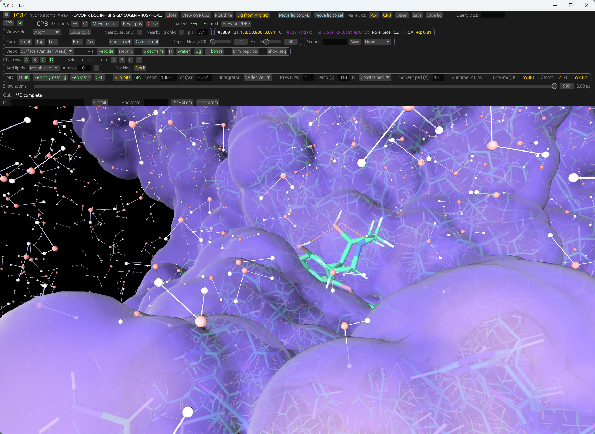
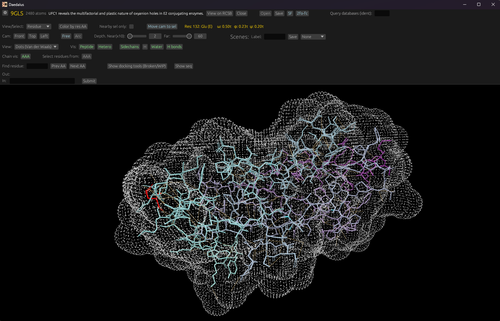
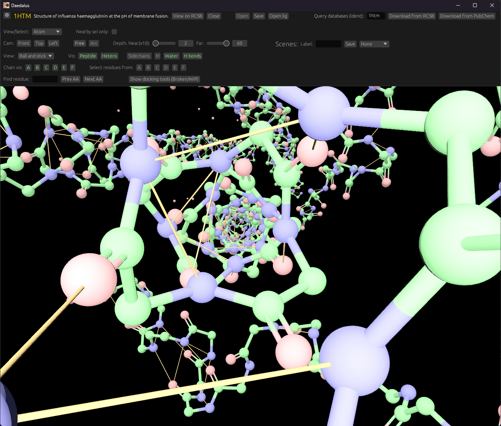
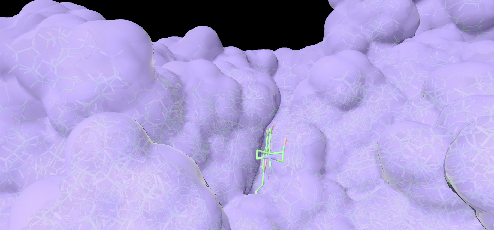
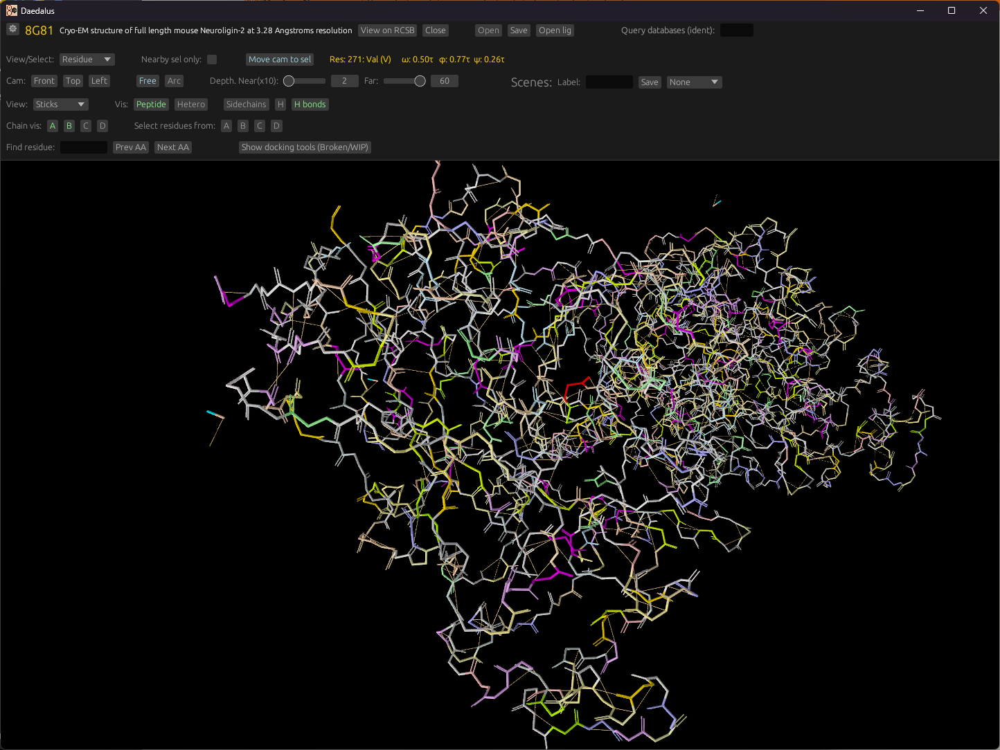
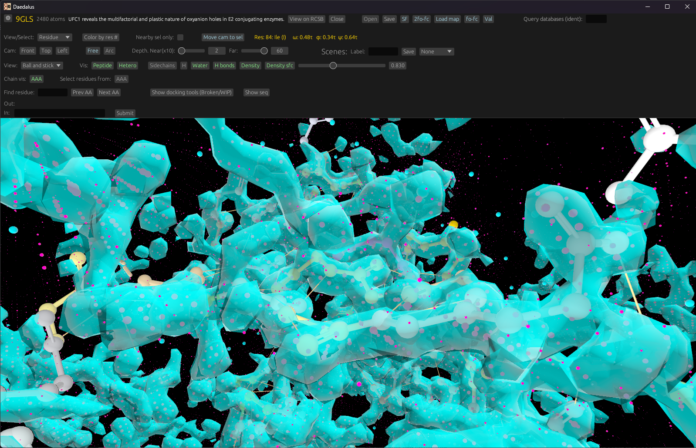
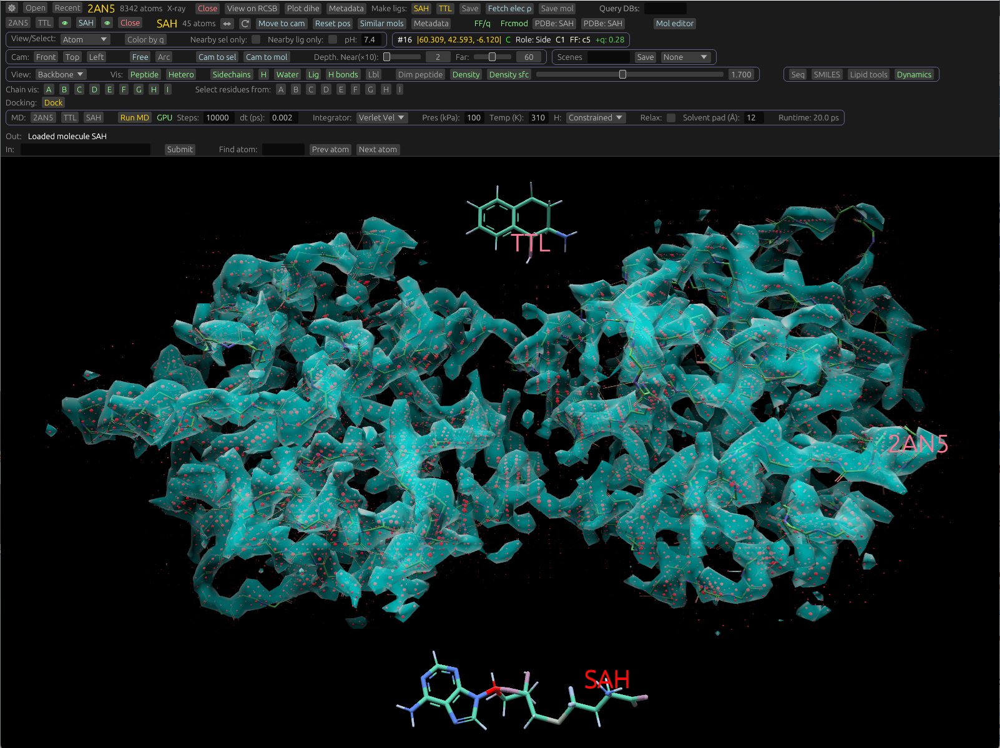

# Molchanica

[Home page](https://www.athanorlab.com/molchanica)
[Documentation](https://www.athanorlab.com/docs)

[Molchanica](https://www.athanorlab.com/molchanica) is molecule editing, visualization, and dynamics tool with a focus
on a smooth user experience. It combines functionality found
in [PyMol](https://www.pymol.org/), [Chimera](https://www.cgl.ucsf.edu/chimera/), [Coot](https://www2.mrc-lmb.cam.ac.uk/personal/pemsley/coot/), [VMD](https://www.ks.uiuc.edu/Research/vmd/), [GROMACS](https://www.gromacs.org/),
and [Avogadro](https://avogadro.cc/), and operates with the focus on visualizing molecules over both time and space. Any
molecule you open or build can move using molecular dynamics. We are actively adding work-flow specific functionality;
for example, molecular docking, and tools for working with LNPs.

Molchanica includes Computer Aided Drug Design (CADD) tools. For example, molecule screening and generation based on
pharmacophores, machine-learning from empirical binding data and more. It automatically estimates ADME and toxicity
parameters.

We hope that Molchanica is intuitive enough that formal documentation isn't required; installing, running, opening, and
viewing molecules should be easy for someone to figure out by downloading, launching, and clicking around the GUI. This
documentation is a supplement that experimental process: It describes each feature. It may highlight features you didn't
know existed, clarify how to use a given feature, and show assumptions and implementations used.

For advanced topics like molecular docking, it provides instructions for achieving the best results. Use the menu on the
left to navigate these documentation pages.

## Installation

### Windows and Linux

[Download, unzip, and run](https://github.com/David-OConnor/molchanica/releases).

Notes:

- On Linux distros that use Gnome (e.g. Ubuntu), run
  `setup_linux_desktop.sh`, included in the zip, to create a Desktop
  GUI entry. (Do not run this with `sudo`.)
- On Windows, the first time you run the program, you may get the message *"Microsoft Defender
  prevented an unrecognized
  app from starting"*.
  To bypass this, click *More info*, then *Run Anyway*.

### Mac, and linux distros we don't provide a binary for

Compile from source by [downloading and installing Rust](https://www.rust-lang.org/tools/install), then running
`cargo build --release` from a CLI
in the project directory. See notes in the
*compiling* section below about setting up Amber parameter files,
and either installing the CUDA toolkit, or disabling CUDA.

### Installing integrated third-party software

Molchanica works with none of these installed; each one unlocks a feature. Open the **Tools**
panel in the GUI at any time to see which are installed and working. Missing tools with an
unattended recipe have an **Install** button in that panel.

Installation runs inside Molchanica through the shared `bio_tools` Rust library. Native
distributions, source checkouts, and model assets live under the user data directory's
`process_executables/`; each isolated Python or Conda environment lives under
`process_executables/python_envs/`, the same layout used by Bio Web. Nothing is installed
system-wide and nothing touches your system Python. On the first
Python-backed tool install, `bio_tools` installs uv with Astral's official standalone installer
if uv is not already available.

| Tool          | Unlocks                                                                               | Size     |
|---------------|---------------------------------------------------------------------------------------|----------|
| `opendde`     | Structure prediction and co-folding: proteins, DNA/RNA, ligands, ions, complexes      | Multi-GB |
| `boltz2`      | Co-folding **and binding-affinity prediction** for a ligand in the complex            | Multi-GB |
| `ligandmpnn`  | Inverse folding — design sequences for a backbone, in ligand and nucleic-acid context | ~1 GB    |
| `proteinmpnn` | Inverse folding, the antibody-tuned AbMPNN weights, and native ΔΔG scanning           | ~1 GB    |
| `igblast`     | Antibody V(D)J germline assignment and framework/CDR delineation                      | ~100 MB  |
| `anarcii`     | Antibody/TCR numbering (IMGT, Kabat, Chothia, Martin, AHo) with insertion codes       | ~1 GB    |

A CUDA build of PyTorch is selected automatically when an NVIDIA GPU with a new enough driver is
present, and the install falls back to CPU if that turns out not to work at run time. Override
with `MOLCHANICA_TORCH_BACKEND=cpu` or `=cu126`.

Each tool requests an exact interpreter minor version from uv: Python 3.13 for OpenDDE and Python
3.12 for Boltz-2, the MPNN tools, and ANARCII. `uv venv --managed-python` ensures these are
uv-managed Python builds rather than matching interpreters found on the system. Set
`MOLCHANICA_UV` only when the installer should use a particular uv executable.

Two tools Molchanica cannot install for you, because they have their own licence gate or
installer: **ORCA** (quantum chemistry, and MBIS partial charges for MD) and **GROMACS** (an
alternative MD backend). Install those separately and put them on `PATH`. **Gemmi**, for MTZ and
unprocessed electron-density files, is installed by the Linux setup script and shipped alongside
the Windows release.

Every tool can also be pointed at an existing installation with an environment variable —
`MOLCHANICA_ORCA_EXECUTABLE`, `MOLCHANICA_IGBLAST_ROOT`, and so on. The Tools panel shows each
tool's variable name.

### Datasets

Molchanica can read a locally downloaded [PDBbind](https://www.pdbbind-plus.org.cn/) release:
measured binding affinities, plus each complex's protein, pocket, and ligand files. Unpack one
into `<data dir>/molchanica/datasets/pdbbind`, or set `MOLCHANICA_PDBBIND_ROOT`. Nothing
downloads it for you — PDBbind+ is distributed under registration, free for academic use, with
commercial use requiring a subscription.

### Protein design

The **Design** button opens sequence design, stability scanning, and antibody annotation for the
protein currently open:

- **Design sequences** proposes sequences that would fold into the backbone on screen, using
  LigandMPNN, ProteinMPNN, or the antibody-tuned AbMPNN weights. You can restrict it to particular
  chains and hold chosen residues fixed — enough to redesign CDRs while keeping a framework, or to
  resurface a protein while preserving a catalytic site.
- **Stability scan** scores all twenty substitutions at every position in one pass, ranking the
  most stabilizing mutations and the positions the structure tolerates least. This runs natively;
  it needs the ProteinMPNN weights installed but no Python at run time.
- **Antibody** identifies heavy and light chains, delineates CDRs, and flags developability
  motifs. With ANARCII installed it upgrades from sequence-position approximations to a real
  numbering assignment with insertion codes; with IgBLAST it adds germline V and J gene calls. The
  panel always states which of the two you are looking at, so an approximation is never mistaken
  for a numbering assignment.

## Functionality

- View the 3D structure of proteins and small molecules
- Molecular dynamics, using Amber force fields, and the OPC water model
- Visualize ligand docking
- Edit small molecules in 3D with integrated dynamics
- Visualize electron density from crystallography and Cryo-Em data
- Run [GROMACS](https://www.gromacs.org/) MD, and view trajectories using the same GUI as our native MD.
- Run [ORCA](https://www.faccts.de/orca/) quantum chemistry procedures on molecules (if ORCA is installed).
- Run [OpenDDE](https://github.com/aurekaresearch/OpenDDE) structure prediction (Proteins, ligands, nucleic acids, ions, complexes)
- Run [Boltz-2](https://github.com/jwohlwend/boltz) co-folding, including binding-affinity prediction for a ligand in the folded complex
- Design sequences for a backbone with [LigandMPNN](https://github.com/dauparas/LigandMPNN) and
  [ProteinMPNN](https://github.com/dauparas/ProteinMPNN), conditioned on ligands and nucleic acids where present
- Scan every point mutation at every position for stability (ΔΔG), in a single pass, natively — no Python needed at run time
- Antibody workflows: real numbering with insertion codes ([ANARCII](https://github.com/oxpig/ANARCII)),
  germline V(D)J assignment ([IgBLAST](https://ncbi.github.io/igblast/)), CDR selection, paratope contacts, and developability triage
- Read a local [PDBbind](https://www.pdbbind-plus.org.cn/) release: look up a complex's measured binding affinity and open its protein, pocket, and ligand files
- Assess pharmacokinetics, screen small molecules for binding to pockets, pharmacophore features, molecule alignment,
  and more.
- Screen molecules based on binding affinity and desired properties
- Pharmacophore based modeling and screening

## Molecule types supported for viewing and dynamics

- Proteins
- Small organic molecules (e.g. ligands)
- DNA and RNA; double and single stranded
- Lipids

## Getting started

Launch the program. Either open a molecule using the "Open" or "Open Lig" buttons, drag the file into the program
window,
enter a protein identifier in the *Query databases* field, or click *I'm feeling
lucky*, to load a recently-uploaded
protein
from the [RCSB PDB](https://www.rcsb.org/).

**Most UI items provide tooltip descriptions, when you hover the mouse over them.**

## Goals

- Fast
- Easy-to-use
- Practical workflow
- Updates responsive to user feedback

## File formats

- **Proteins**: mmCIF (aka PDBx)
- **Small molecules**: SDF, Mol2, GRO, XYZ, and PDBQT
- **Electron density**: 2fo-fc mmCIF, Map, and MTZ
- **Force field parameters**: dat, lib, frcmod, prmtop (Amber), and top (GROMACS)
- **MD**: GRO, MDP, DCD, TRR, XTC

## Third-party tool integrations

Molchanica integrates with a number of third-party tools, acting on the molecules Molchanica has open,
or creating them. See [the docs page for details, and a full list of tools](https://www.athanorlab.com/docs/third_party_tools.html). These can be accessed directly from the computer if you have them installed,
or installed within the application's UI.

## Example tools supported:

- OpenDDE
- GROMACS
- ORCA
- Boltz-2
- MPNN (Protein, ligand etc)
- igBLAST
- ANARCII

(todo: Expand:)

## A note on internet connectivity

This application can run smoothly without internet connectivity. If you do have internet, it has some API integrations
which may help. For example, loading molecules automatically from PubChem, drugbank, and RCSB PDB. It can also
download associated ligands for a protein, automatically download molecule-specific force-field parameters, and
other party tricks.

## Parallel computing

If an Nvidia GPU of at least RTX 3 series is available, molecular dynamics, docking, and electron density calculations
will be performed using the GPU (via CUDA kernels). If not, the CPU will be used, leveraging thread pools
and SIMD instructions. It uses all cores available, and either 512-bit, or 256-bit, SIMD instructions, depending
on CPU capability.

GPU functionality requires Nvidia driver version 580 or higher.

## Molecular dynamics

This application fully integrates classical molecular dynamics setup and playback into the GUI.
For details, see [the documentation](https://www.athanorlab.com/docs/md.html).

It supports running MD directly on the following molecule types, without loading any other data:

- Proteins/amino acids
- Small organic molecules
- DNA and RNA
- Lipids
- Carbohydrates (WIP)

Overview of MD components:

- [Amber parameters](https://ambermd.org/AmberModels.php)
- Velocity Verlet integrator
- [CSVR](https://arxiv.org/pdf/0803.4060) or Langevin Middle thermostats
- Explicit OPC water model
- SPME Coulomb forces
- AM1-BCC partial charges (MBIS if you have ORCA installed)

We use the [Dynamics rust library](https://github.com/david-oconnor/dynamics) for the implementation. You may also wish
to reference that library's readme.

## Editing molecules

We provide an editor for small organic molecules. This is fully-3D, and has integrated dynamics, which can be run
continuously
while you edit. It ensures the molecules you create are realistic, and take the appropriate shape.

## The camera

The camera is set up with 6 degrees of freedom, using either keyboard + mouse, or mouse only. This makes
it easy to get any view of the system you want.

There are two camera control schemes, selectable using buttons in the *camera* section of the GUI.

### Free camera

The *free
camera* mode is intended to be used with a keyboard and mouse together. They operate on the perspective of
the viewer, vice the molecule. You can move and rotate and move the camera
in 6 degrees of freedom, allowing you to easily view the molecule from any perspective.

### Arc camera

Similar to traditional molecular viewing software. The camera arcs (or orbits) around the molecule, when holding the
left
mouse button and dragging. Other controls, like scroll wheel and middle mouse, operate similar to the free camera.
If *orbit
sel* is set in the GUI, the orbit center will be the selected atom or residue, vice the molecule center.

### Hotkeys

Most of this functionality is also available in the GUI, and you can find hotkeys from the GUI's tooltips. We recommend
starting with the GUI, and integrating hotkeys into your workflow as you go, using tooltips.
See below for a reference.

#### Mouse controls:

- Hold the **left mouse button while dragging** to rotate the camera in pitch and yaw.
- Hold the **middle mouse button while dragging** to move the camera left, right, up, and down.
- **Scroll** to move the camera forward and backwards.
- **Scroll while holding left mouse button** to roll.
- **Right click
  ** to select the atom or residue under the cursor. This also selects the molecule to manipulate.

#### Camera hotkeys

- **W**: Move forward
- **A**: Move right
- **A**: Move left
- **D**: Move back
- **Space**: Move up
- **C**: Move down
- **Q**: Roll counter-clockwise
- **R**: Roll clockwise

- **Shift** (left): Hold to increase camera movement and rotation speed.
- **Scroll whlie holding left mouse**: Roll (Alternative to Q/R)

### Non-camera hotkeys

- **Left arrow**: select previous residue
- **Right arrow**: select next residue

- **Left arrow**: Select previous residue
- **Right arrow**: Select next residue

- **Left backet**: Previous view mode (sticks, surface mesh etc)
- **Right bracket**: Next view mode

- **Semicolon**: View/select level (Atoms, bonds, residues)
- **Right bracket**: Next view/select level

- **M**: Move a molecule with the mouse and scroll wheel
- **R**: Rotate a molecule with the mouse and scroll wheel

- **Enter**: Move the camera to the selected atom or residue.
- **Esc**: Clear selection, molecule manipulation modes etc.

- **Ctrl + scroll**: Change the fog distance. (hide distant atoms)

- **Delete
  **: In the primary mode, close the active molecule. In the molecule editor, this deletes the selected atom or
  bond.

- **Enter**: Move the camera to the selected atom, bond, or residue.

- **Tab**: In the molecule editor, adds an atom.

Note: The molecule editor has a different set of hot keys; see its tooltips for details.

## Reflections and electron density

Supports volumetric and isosurface views for electron density data, e.g. from Cryo-EM and X-Ray crystallography data.
It can download this data from RCSB PDB, or load files directly. To open *2fo-fc* and
*MTZ* files, we use the
[Gemmi](https://gemmi.readthedocs.io/en/latest/install.html) program. For this to work, the
`gemmi` folder
we include must remain co-located with the program's executable, or be on the system path. For convenience, we package
it with the Windows release, and the linux install script optionally installs it with `apt`.

Can import Map files directly, and save load density to Map format.

## Pharmacokinetics

Uses neural networks to infer pharmacokinetic properties of arbitrary small molecules,
using [Therapeutic Data Commons](https://tdcommons.ai/) data.

## PyMol-like Command line interface

Molchanica supports a very limited subset of PyMol's CLI interface. Supported commands:

### General

- `help`: Lists commands
- `pwd`
- `ls`
- `cd`
- `set seq_view`

### File IO

- `fetch`: Loads a protein from the RCSB PDB. e.g. `fetch 1C8K`
- `save`: Save the opened protein or small molecule to disk. e.g. `save molecules/1htm.cif`
- `load`: Load a protein or small molecule from disk. e.g. `load ../1htm.cif`

### View and edit

- `show`: Set the view mode. e.g. `show sticks`
- `view`: Save and load scenes. e.g. `view v1`, `view v1 store`, `view v2 recall`
- `hide`: Limited options available, e.g. `resn HOH`, `hydro`, `chain`, `hetatm` etc.
- `remove`: Limited options available, e.g. `resn HOH`, `hydro`, `chain`, `hetatm` etc.

### Selections

- `select resn`: Select a residue by 3-letter amino acid identifier
- `select resi`: Select a residue by index
- `select elem`: Select an atom by element abbreviation

(`sele` works too)

### Camera controls

- `turn`
- `move`
- `orient`
- `reset`

### Selection modes

Using a dropdown in the UI, you can change selection mode between *Atom*, (covalent) *Bond*, and
*Residue*. These are
mostly self-explanatory.
When selecting a component using *right
click*, or toggling using the UI buttons or arrow keys, this changes
what is selected, and the nature of information displayed. For example, in
*Bond* mode, you can see bond length,
elements of the atoms connected, and the expected oscillation frequency of the bond. In
*Atom* mode, you can see
dihedral angles, the atom name as part of its residue, the atom's force field name, and its partial charge.

### MD playback

Molchanica can play back molecular dynamics trajectories run from other programs, including GROMACS, OpenMM, and NAMD.

### Adding nucleic acids and lipids

You can add DNA, RNA, and lipids in various configurations without loading files; this program can create
them procedurally using the GUI. It can create DNA and RNA from a given nucleic acid or amino acid sequence. It
can create lipids arranged freely, as membrances, or as lipid nanoparticles (LNPs).

### The preferences file

You may notice that this program places a
*molchanica_prefs.mca* file in the same folder as the executable. This
is a small binary file containing application state. It's what lets it remember the last file opened, current
view settings etc. It will grow with the number of molecules you've opened, as it stores per-molecule
settings. Deleting it is harmless, other than resetting these conveniences.

### Compiling

This application is written in rust, so it compiles normally using
`cargo build --release`, which produces a
standalone executable.

If you're not running on a machine with an Nvidia GPU or without the CUDA toolkit installed, append the
`--no-default-features` to the build command. This will disable GPU support on the executable produced.

#### Compiling with GPU support

If compiling with GPU support, your compiling PC must have
the [CUDA Toolkit, v13+](https://developer.nvidia.com/cuda-downloads) installed. You must set the environment var
`LD_LIBARARY_PATH` (Linux) or `Path` (Windows) to your CUDA bin directory, e.g.
`C:\Program Files\NVIDIA GPU Computing Toolkit\CUDA\v13.0\bin`. You may also need the build tools containing
`cl.exe` or
similar in the path, e.g.:
`C:\Program Files\Microsoft Visual Studio\2022\Community\VC\Tools\MSVC\14.44.35207\bin\Hostx64\x64`

### Errata

- Only one protein can be loaded at a time
- Opening electron density files in general can be slow. This can lead to the program starting slowly if it was
- Minimizing may pause molecular dynamics computations.
- On some displays (Ones with pixel scaling), dragging the MD time slider may also move the camera. To workaround, click
  the slider instead of dragging.

[//]: # (Wub from LabRats didn't dissaprove of the project name!)
